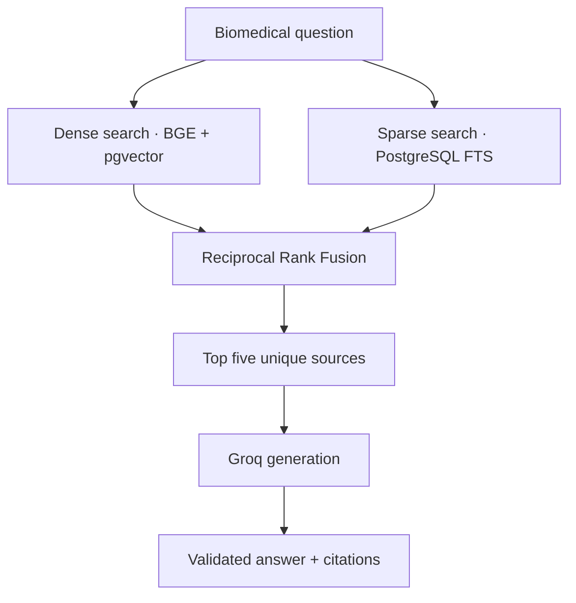

<div align="center">

# 🩺 Evidence-Grounded Biomedical Hybrid RAG

### Hybrid search • grounded generation • verified citations


An evaluated biomedical question-answering system that combines semantic vector search and PostgreSQL full-text search over **NFCorpus**, then generates evidence-grounded answers with validated source citations.

[Architecture](#-architecture) • [Results](#-evaluation-results) • [Setup](#-quick-start) • [Usage](#-usage)

</div>

---

## ✨ What It Does

- Indexes **3,633 biomedical documents** as **5,323 token-aware chunks**.
- Retrieves evidence using BGE embeddings, pgvector, HNSW and PostgreSQL full-text search.
- Combines dense and sparse rankings with equal-weight Reciprocal Rank Fusion.
- Generates answers through Groq using the five highest-ranked unique sources.
- Validates `[S1]`, `[S2]`, ... citations and refuses unsupported questions.
- Measures retrieval quality against graded relevance judgments.

## 🧠 Architecture



Documents are recursively split into 350-token chunks with 50-token overlap. Each title is prepended to its chunks before producing normalized 384-dimensional embeddings with `BAAI/bge-small-en-v1.5`.

## 📊 Evaluation Results

Measured at `K=10` on all **323 NFCorpus test queries**:

| Retrieval stage | P@10 | Recall@10 | MRR@10 | NDCG@10 | Avg. latency |
|:--|--:|--:|--:|--:|--:|
| Dense | 0.2563 | 0.1591 | 0.5275 | 0.3432 | 0.143 s |
| Sparse | 0.1393 | 0.0908 | 0.3502 | 0.2081 | 0.067 s |
| **Hybrid RRF** | **0.2638** | **0.1712** | **0.5597** | **0.3617** | **0.210 s** |

Compared with dense-only retrieval, Hybrid RRF improved:

- **Recall@10 by 7.6%**
- **MRR@10 by 6.1%**
- **NDCG@10 by 5.4%**

Equal dense/sparse weighting was selected on the development split. See [`results/benchmarks.md`](results/benchmarks.md) for the recorded experiments.

## 🛠️ Tech Stack

| Component | Technology |
|:--|:--|
| Embeddings | BAAI/bge-small-en-v1.5 |
| Vector search | PostgreSQL, pgvector, HNSW |
| Lexical search | PostgreSQL TSVECTOR and GIN |
| Rank fusion | Reciprocal Rank Fusion |
| Generation | Groq Chat Completions API |
| Chunking | LangChain Text Splitters |
| Infrastructure | Docker Compose |

## 🚀 Quick Start

### Requirements

- Python 3.13
- Docker Desktop
- Groq API key

### 1. Install

```powershell
git clone https://github.com/YOUR_USERNAME/nfcorpus-hybrid-rag.git
cd nfcorpus-hybrid-rag
python -m venv .venv
.\.venv\Scripts\Activate.ps1
python -m pip install -r requirements.txt
Copy-Item .env.example .env
```

Add your database settings and Groq API key to `.env`. Never commit this file.

### 2. Add NFCorpus

Download NFCorpus from [BEIR](https://github.com/beir-cellar/beir) and extract it to:

```text
data/raw/nfcorpus/
├── corpus.jsonl
├── queries.jsonl
└── qrels/{train,dev,test}.tsv
```

Validate it:

```powershell
python -m src.dataset_loader --split test
```

### 3. Start the database and index the corpus

```powershell
docker compose up -d
python -m src.indexer
```

### 4. Run

```powershell
python app.py
```

## 💬 Usage

```text
Question: What are the effects of statins on breast cancer survival?

Answer:
Observational cohort studies have found that breast cancer patients who use
statins have a lower risk of dying from breast cancer ... [S1]. A UK cohort
also reported a modest reduction in breast cancer-specific mortality ... [S2].

Cited sources:
[S1] MED-10 - Statin Use and Breast Cancer Survival
[S2] MED-14 - Statin use after diagnosis of breast cancer and survival
```

When the retrieved evidence is insufficient:

```text
The retrieved sources do not contain enough information to answer this question.
```

## 🧪 Evaluation

```powershell
python -m src.evaluator --split test
python -m src.fusion_experiment --split dev
```

## 📁 Project Structure

```text
nfcorpus-hybrid-rag/
├── app.py                  # Interactive CLI
├── docker-compose.yml     # PostgreSQL/pgvector
├── sql/init.sql           # Schema and indexes
├── results/benchmarks.md  # Evaluation results
└── src/
    ├── chunker.py         # Token-aware splitting
    ├── embedder.py        # BGE embeddings
    ├── indexer.py         # Corpus indexing
    ├── retriever.py       # Dense, sparse and RRF search
    ├── context_builder.py # Unique source selection
    ├── answer_generator.py # Grounded generation
    ├── rag_pipeline.py    # End-to-end pipeline
    └── evaluator.py       # Retrieval metrics
```

## ⚕️ Disclaimer

This is an information-retrieval engineering project, not a medical device or a source of medical advice.

---

<div align="center">

**Built with Python, PostgreSQL, pgvector and Groq**

Made by **[Your Name](https://github.com/YOUR_USERNAME)**

</div>
